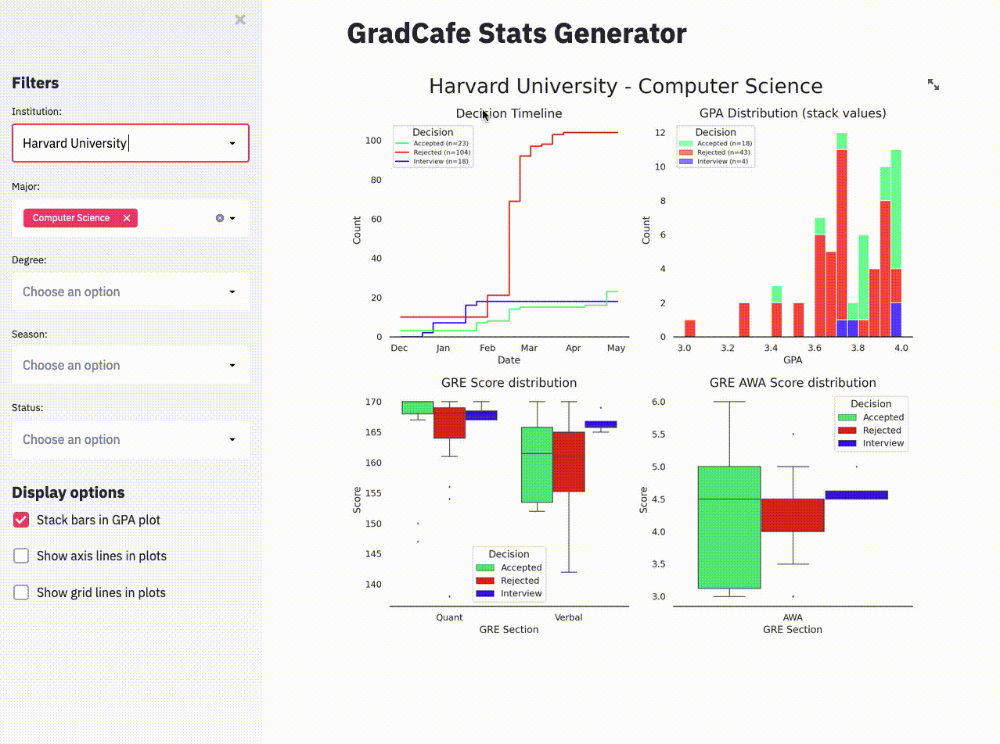

# Grad Stat - Query Grad Admissions Historical Data Easily

Site that allows you to query GradCafe data and generate stats based on the filters you select. Took advantage of the ease that `streamlit` provides when writing apps and created this data exploratory app for scraped GradCafe data.

## How to use it

[Overview video](https://youtu.be/5puIG1nuOxg)

Querying GradCafe data has never been easier, you just select the school you wanna focus on, your major, your type of degree, and the cycles you wanna consider and off you go.

All comboboxes in the interface are editable in that you can type and they will show you the closest matches to your query.

## Requirements

See `requirements.txt` but here are the main ones:

* streamlit
* pandas
* sns
* plt

### NOTE

GradCafe entries are probably the definitions of selection bias so take these stats with a grain of salt.
